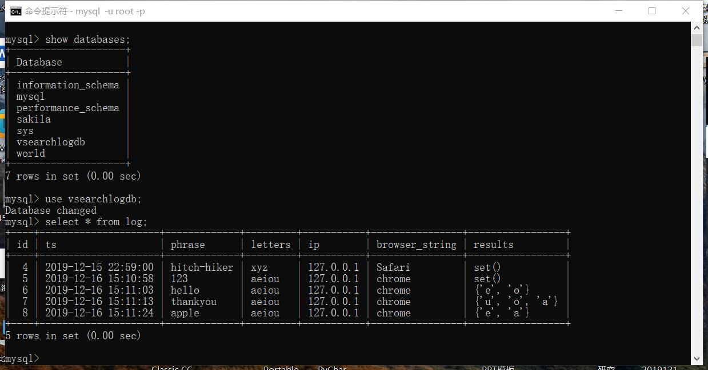
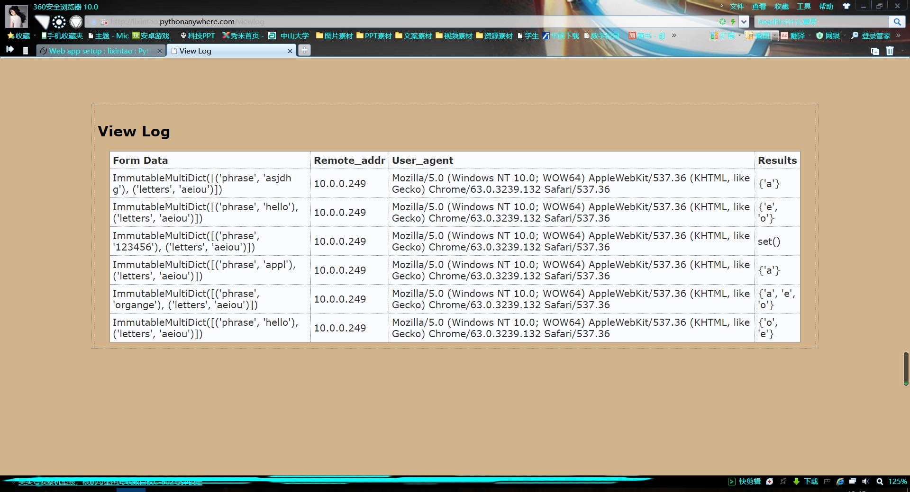

# python笔记

#### 介绍
用于记录总结2019秋季学期的python课程及能力展示。

#### 个人简介
姓名：李鑫桃；班级：18网新3班；自述：本人在本学期自认在前期没有太用力去学习python，但自从经历期中考试后，我开始重新审视自己，开始认真学习python，现不停地追赶上老师的讲课进度。我会为了不拖累别人和自己而全力完成任务。

#### 部分项目展示

1.  DB-api

2.python anywhere

